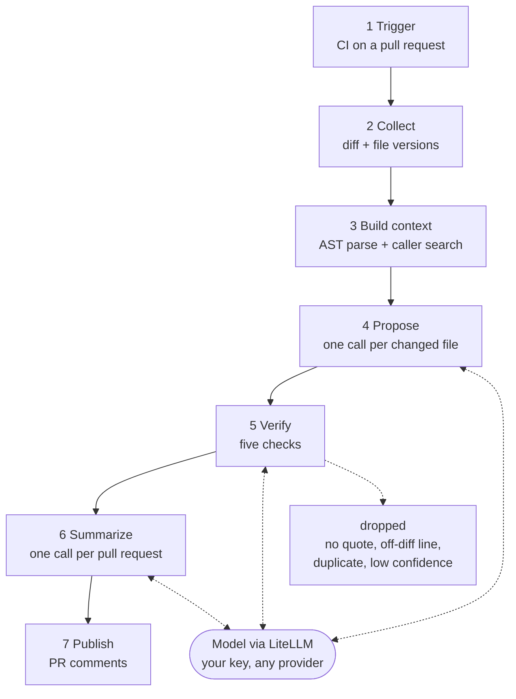

# groundtruth-review

**An AI code reviewer that proves what it claims.**

[](https://github.com/groundtruth-code-review/groundtruth-code-review/actions/workflows/ci.yml)
[](LICENSE)

Nothing gets posted to a pull request unless it's grounded in code that
provably exists in the diff and survives a second, adversarial AI pass
cross-examining it. No vector database, no RAG — context comes from a
deterministic pipeline (git + Tree-sitter + a caller search), so a wrong
retrieved snippet can't produce a confident, wrong finding.

Bring your own model and your own API key — Anthropic, OpenAI, Azure, Bedrock,
or a fully local Ollama model, picked by one config line. Runs anywhere your
code already lives: GitHub, GitLab, Bitbucket Cloud, or self-hosted Bitbucket
Data Center.

> **Status: early / alpha.** The pipeline, the CLI, the eval harness and the
> GitHub, GitLab and Bitbucket Cloud adapters are implemented and tested
> (290 tests, all green). An optional server mode — an ingest API and the
> database behind it — is implemented too (7 more tests, against a real
> Postgres); a webhook receiver for Bitbucket Data Center and anything that
> reads that database back out are not. See [Roadmap](#roadmap). Nothing
> here is published to PyPI yet — the install instructions below use a git
> URL until it is.

## How a review flows

Seven stages, each handing the next exactly one thing. The dotted lines are
the only three model calls, and each is a round trip: stage 4 sends one file's
diff with the assembled context and gets candidate findings back, stage 5
sends a single finding with its evidence and gets a verdict, stage 6 sends the
verified set and gets one grouped summary. Everything else — parsing,
searching, quote matching, fingerprinting — is ordinary code.



The same pipeline, with a worked example traced through every stage and the
handoffs animated, is at
**[groundtruth-code-review.github.io/groundtruth-code-review](https://groundtruth-code-review.github.io/groundtruth-code-review/)**.

Stage 3 is where the interesting work happens, and it calls no model at all:
a changed line becomes the whole function that contains it, that function's
real callers are found by text search, and a changed signature promotes those
callers to must-include &mdash; which is how a break in a file the pull request
never touched still reaches the reviewer.

## Why

Most AI PR reviewers optimize for *coverage* — say something about everything.
This one optimizes for *precision* — a quiet, accurate bot beats a chatty,
clever one, because a wrong comment costs more trust than a missed one. Two
decisions follow from that:

1. **Context is deterministic, not retrieved.** Instead of embeddings and
   similarity search, the reviewer parses the actual changed function, finds
   its real callers with a text search, and — if a function's signature
   changed — promotes those callers to *must-include* context. A caller still
   passing the old argument list is exactly the bug a diff-only review can't
   see.
2. **Nothing posts unverified.** Every finding must quote code that literally
   exists in the diff (a hallucination check), get cross-examined by a second
   LLM call whose confidence is *multiplied* against the first — never
   averaged, because averaging lets a confident wrong answer outvote a
   skeptical right one — and clear a fingerprint check so re-runs never
   duplicate a comment or falsely mark a live bug resolved.

## How it's put together

```
src/groundtruth/
├── context_engine/   # diff → hunks → enclosing functions → callers →
│                      # signature-change detection → a budgeted context payload
├── quality_gate/      # hallucination check, adversarial cross-examination,
│                      # fact-based fingerprinting — the verification pipeline
├── llm/                # a thin, embedded LiteLLM wrapper: model choice + BYOK
│                       # live here, not in a separately-deployed proxy
├── reviewer.py          # PROPOSES findings — the least-trusted module;
│                        # quality_gate does the trusting. Reviews one file
│                        # at a time (not the whole PR in one call) — a
│                        # single large-diff pass measurably loses recall
├── summary.py            # one cheap call that groups verified findings into
│                         # a summary comment — and throws its own output away
│                         # if it names anything outside the verified set
├── eval/                  # replay labeled cases, grade caught / gated /
│                          # missed / false positive — `groundtruth eval`
├── git_source.py           # the only place that shells out to git
├── config.py                # .groundtruth.yml loading (and refusing to load a
│                            # config that looks like it holds a live key)
└── cli.py                    # `groundtruth review` and `groundtruth eval` —
                               # the commands every front door below calls

adapters/
├── common.py          # what every adapter says: summary markdown, inline
│                       # comment bodies, and the hidden fingerprint marker
│                       # that carries the review's memory to the next push
├── github/             # a composite GitHub Action (action.yml + publish.py)
├── gitlab/              # a GitLab CI job (notes + positioned discussions)
└── bitbucket_cloud/      # a Pipelines step (comments with inline anchors)
```

Each adapter holds only its own API. `adapters/common.py` holds the text, so
a wording fix reaches all three at once, and no adapter imports
`groundtruth` itself — they run the CLI and read its JSON.

Neither `context_engine` nor `quality_gate` imports anything platform-specific
— they take a diff and a repo path in, and return findings out. Every SCM and
every trigger (a CI job, a webhook server) is a thin adapter around that same
core, which is what makes "any platform, any model" a real property of the
design instead of a slogan. Three adapters are the proof rather than the
promise: each is a few dozen lines of API calls over the same JSON.

## Using it on GitHub

Add this workflow to any repo (`fetch-depth: 0` matters — the CLI needs full
history to diff against the base ref, not the default shallow clone):

```yaml
# .github/workflows/groundtruth.yml
on: pull_request
# A second push cancels the review still running for this PR, instead of
# racing it to write the summary comment last.
concurrency:
  group: groundtruth-${{ github.event.pull_request.number }}
  cancel-in-progress: true
permissions:
  pull-requests: write
jobs:
  review:
    runs-on: ubuntu-latest
    steps:
      - uses: actions/checkout@v7
        with: { fetch-depth: 0 }
      - uses: groundtruth-code-review/groundtruth-code-review/adapters/github@main
        with: { model: anthropic/claude-sonnet-5 }
        env:
          ANTHROPIC_API_KEY: ${{ secrets.ANTHROPIC_API_KEY }}
```

That's the whole install — one repo secret, one short workflow file. No
server, no database, no webhook to register.

## Using it on GitLab

Copy [`adapters/gitlab/gitlab-ci.example.yml`](adapters/gitlab/gitlab-ci.example.yml)
into your `.gitlab-ci.yml`. Two settings matter: `GIT_DEPTH: 0`, because the
review diffs against the merge target a shallow clone does not contain, and a
project access token with `api` scope — `CI_JOB_TOKEN` cannot post notes.
Findings land as positioned discussions, the summary as one edited note.

## Using it on Bitbucket Cloud

Copy [`adapters/bitbucket_cloud/bitbucket-pipelines.example.yml`](adapters/bitbucket_cloud/bitbucket-pipelines.example.yml)
into your `bitbucket-pipelines.yml`. It needs `clone: depth: full` and a
fetch of the destination branch, which Pipelines gives you by name rather
than as a SHA. Findings land as inline-anchored comments.

## Running it in Kubernetes, or any container

There is no server to deploy and no Helm chart to install: a review is one
command that reads a diff and exits. What in-cluster CI needs is the image,
so a Tekton task, an Argo Workflows step or a Jenkins-on-Kubernetes agent can
run the review as a pod:

```yaml
image: ghcr.io/groundtruth-code-review/groundtruth-code-review:0.1.0
args: ["review", "--repo", "/workspace", "--base", "origin/main", "--format", "json"]
env:
  - name: ANTHROPIC_API_KEY
    valueFrom:
      secretKeyRef: { name: groundtruth, key: api-key }
```

The image carries `git` and `ripgrep`, runs as an unprivileged user, and its
`Dockerfile` is multi-stage: the runtime stage installs a wheel that only
exists if lint, both test suites and the eval thresholds passed first, so a
failing suite cannot produce a shippable image.

Inject the provider key from a real secrets manager — the `secretKeyRef`
above is the minimum, and External Secrets or a Vault agent is better. The
key is never read from config, only from the environment.

## Quickstart (CLI + library)

```bash
git clone https://github.com/groundtruth-code-review/groundtruth-code-review
cd groundtruth-code-review
python3 -m venv .venv && source .venv/bin/activate
pip install -e ".[dev]"
pytest
```

The CLI works against any local git repo — no API key needed to see the
shape of the output, since `--dry-run` never calls the model:

```bash
groundtruth review --repo /path/to/some/repo --base main --head HEAD --dry-run --format text
```

With a real key set (`ANTHROPIC_API_KEY`, matching whatever `model:` your
`.groundtruth.yml` names), drop `--dry-run` to get real, verified findings:

```bash
groundtruth review --repo /path/to/some/repo --base main --head HEAD --format json
```

This example is copy-pasteable and runs as-is (no repo, no API key needed) —
it shows the context engine finding both the changed function *and* the
caller elsewhere in the tree that a diff-only review would never see:

```python
import tempfile
from pathlib import Path
from groundtruth.context_engine import build_context, parse_diff

diff_text = """diff --git a/invoice.py b/invoice.py
--- a/invoice.py
+++ b/invoice.py
@@ -1,2 +1,3 @@
 def calculate_discount(price):
-    return price * 0.9
+    rate = 0.9
+    return price * rate
"""
head_source = "def calculate_discount(price):\n    rate = 0.9\n    return price * rate\n"

with tempfile.TemporaryDirectory() as repo:
    Path(repo, "invoice.py").write_text(head_source)
    Path(repo, "checkout.py").write_text(
        "from invoice import calculate_discount\n\n"
        "def checkout(p):\n    return calculate_discount(p)\n"
    )

    ctx = build_context(
        repo_root=repo,
        diffmap=parse_diff(diff_text),
        head_sources={"invoice.py": head_source},
    )
    for block in ctx.blocks:
        print(block.label)
        print(block.text)
        print("---")

# invoice.py#L1-3 (changed)
# def calculate_discount(price):
#     rate = 0.9
#     return price * rate
# ---
# checkout.py#L3-4 (caller of calculate_discount)
# def checkout(p):
#     return calculate_discount(p)
# ---
```

## Configuration

```yaml
# .groundtruth.yml — safe to commit: it can never hold a key
model: anthropic/claude-sonnet-5   # or openai/gpt-4o, ollama/qwen2.5-coder, ...
max_cost_per_run: 1.00             # personal-use safety ceiling, whole run
min_confidence: 0.7                # the quality gate's default bar
max_inline_comments: 10
context_token_budget: 25000        # context assembled per review
max_diff_tokens_per_call: 6000     # a bigger file is reviewed in hunk groups
summary: true                      # one cheap call to group the findings
dimensions: [correctness, security, conventions]

# Optional: a different model for the checking stages. Unset means every
# stage uses `model` above — splitting them is something you opt into.
# verify_model: anthropic/claude-haiku-4-5-20251001
# summary_model: anthropic/claude-haiku-4-5-20251001

# The verifier can be a different provider entirely. Claude proposes and GPT
# cross-examines, or the other way round — set both providers' keys.
# verify_model: openai/gpt-4o-mini

# Optional: sampling settings, per model — temperature, top_p, max_tokens.
# Mostly for reasoning models, which often want temperature 1 and a larger
# token budget because they think before they answer.
# model_params: {temperature: 1, top_p: 1, max_tokens: 16384}
# verify_model_params: {temperature: 0.1, max_tokens: 2048}
```

Settings follow the model they were tuned for: a stage inherits them only
when it runs the same model. `stream` isn't supported — every reply is
parsed as one JSON object, so it has to arrive whole. Only those three
settings are accepted, within bounds, because the pull request under review
can edit this file.

### Endpoints

By default each model is called at its provider's own endpoint. To send a
stage somewhere else — NVIDIA's API catalog, Azure, a self-hosted model, or
your org's LiteLLM proxy — set it in the environment or on the command line:

```bash
export NVIDIA_NIM_API_KEY=...
export GROUNDTRUTH_BASE_URL=https://integrate.api.nvidia.com/v1

groundtruth review --base main --model nvidia_nim/moonshotai/kimi-k3
```

Each stage can have its own: `GROUNDTRUTH_BASE_URL` (review, and the
default for all), `GROUNDTRUTH_VERIFY_BASE_URL`, `GROUNDTRUTH_SUMMARY_BASE_URL`,
or `--base-url` / `--verify-base-url` / `--summary-base-url`. Flags beat the
environment. An endpoint follows the model it serves: if the summary inherits
the verifier's model, it inherits the verifier's endpoint too.

**Endpoints are never read from `.groundtruth.yml`, and it refuses to load if
one is there.** An endpoint decides which server receives your API key along
with your code, and that file is in the repository under review — so the pull
request being reviewed can edit it. A review bot run on `pull_request_target`
(common, because it's how a bot comments on forks) hands the job your
secrets, and a fork that pointed the endpoint at its own server would collect
your key on the first call. So endpoints come from the same place keys do:
whoever owns the key sets where it goes.

**Verify with a different provider.** The skeptic pass exists to be a second
opinion, and a second opinion from the same model isn't much of one — two
calls to one model share its training and its blind spots, and a model
judging its own kind of output tends to agree with it. So `verify_model` can
name a different provider from `model`: review with Claude and verify with
GPT, or the reverse. The verifier is never told which model proposed the
finding. It needs both providers' keys in the environment; miss one and the
run reports itself as failed rather than clean. Whether it helps on your
code is something the `eval` harness can tell you — run your cases both ways
and compare.

`max_cost_per_run` covers the whole run, not just the review pass: the
ceiling is re-checked before the verification pass (one call per candidate)
and before the summary call, because the number of those calls is not known
until the review returns.

`config.py` refuses to load a `.groundtruth.yml` that contains anything
key-shaped (a `sk-...` prefix, or a long opaque token) — loudly, with an
error naming the offending field, not a silent skip. That's what makes the
"safe to commit" claim above enforced rather than just asked nicely.

API keys are **environment variables, always** — `ANTHROPIC_API_KEY`,
`OPENAI_API_KEY`, etc. — never config, never committed. See `.env.example`.
For a team or CI deployment, inject that environment variable from a real
secrets manager (HashiCorp Vault or a cloud equivalent) rather than a `.env`
file at all.

## Roadmap

- [x] `context_engine` — diff parsing, Tree-sitter chunking, caller search,
      signature-change detection, budgeted assembly
- [x] `quality_gate` — hallucination check, adversarial skeptic pass
      (multiply-not-average confidence), fact-based fingerprinting
- [x] `llm` — embedded LiteLLM wrapper: BYOK, any model by name, pre-call
      cost estimation
- [x] `reviewer` — the LLM pass that proposes candidate findings for
      `quality_gate` to verify or reject. Batched per changed file, not one
      call over the whole diff: a single pass over a large, multi-file PR
      measurably loses recall as the diff grows (a well-documented LLM
      behavior, not a context-window limit) — it reports the most-salient
      few issues and stops, then "finds more" on the next re-review once the
      diff has shrunk from earlier fixes. Reviewing file-by-file keeps every
      file's review call bounded regardless of overall PR size, so file 15
      gets the same attention as file 1
- [x] `git_source` + `config` — git integration and `.groundtruth.yml`
      loading, including the "refuses to load a config with a key in it" check
- [x] `cli` — `groundtruth review`, the one command every front door calls:
      `.groundtruth.yml` loading, `--model` override, `--dry-run` /
      `max_cost_per_run` safety ceiling, JSON and text output
- [x] `adapters/github` — a composite GitHub Action: upserted summary
      comment plus one inline comment per finding, stdlib-only, no
      dependency on the `groundtruth` package itself
- [x] `summary` — one cheap call that groups verified findings, gated by its
      own grounding check and falling back to the plain list on any failure
- [x] fingerprint memory between pushes — carried in a hidden marker inside
      the summary comment, so a re-review never repeats a comment and no
      database is needed
- [x] `eval` — labeled replay, catch / gated / missed / false-positive
      grading, and `--min-catch` / `--max-fp` thresholds for CI
- [x] `adapters/gitlab`, `adapters/bitbucket_cloud` — same core command,
      each speaking only its own API
- [x] a container image and the CI that gates it — multi-stage build whose
      test stage gates the wheel, published to GHCR on a version tag
- [ ] publish to PyPI, so installing stops meaning a git URL
- [x] `groundtruth.server` — an optional, self-hosted ingest API and the
      three-table Postgres schema behind it (`pip install
      "groundtruth-review[server]"`; `docker compose -f
      deploy/docker-compose.yml up` for local dev). Each CI adapter POSTs
      its JSON output here if `GROUNDTRUTH_INGEST_URL` is set; unset by
      default, and nothing about the CLI or the three CI adapters changes
      either way. This is the durable store the design otherwise has none
      of — review history outliving one pull request — and phase 1 of
      [docs/server-mode-design.md](docs/server-mode-design.md)
- [ ] `adapters/bitbucket_dc` — the webhook receiver and queue that write
      to the schema above directly, for the one platform with no free
      per-pull-request CI container; and the Helm chart that installs it.
      Deliberately not started before the receiver exists: a chart with no
      workload to run, and sizing numbers nobody measured, would be YAML
      pretending to be a deployment. Phase 2 of the same design doc, not
      yet built — nothing yet reads the schema above back out, either
      (no dashboard, no feedback loop: phase 3)

## Measuring it

A review tool you cannot measure is one nobody can improve. `cases/` holds
labeled diffs, and every case says which of two things it measures:

- **`pipeline`** — the gate and the context engine. The recorded model
  response is shaped to make one specific thing happen — a quote with its
  whitespace collapsed, a real line reported at the wrong number, two
  findings in one hunk — and the case checks the pipeline handles it.
  Offline only: a live model won't reproduce the exact mistake the case was
  built around.
- **`recall`** — a real bug a model should find on its own.

Be clear about what the offline run proves. Every recorded review already
contains the bug, so an offline "catch" means the pipeline let a known-good
finding through — it says nothing about whether a model would have found
it. That is what `--live` is for: the recorded answers are discarded and
your configured models have to find each bug themselves.

```bash
groundtruth eval --live --verify-model openai/gpt-4o-mini
```

Offline it runs free, with no key:

```bash
groundtruth eval --cases cases --min-catch 0.8 --max-fp 0.2
```

Every expected finding lands in one of three buckets, and the distinction
is the point: **caught** posted, **gated** proposed but rejected by a gate
stage, **missed** never proposed at all. Gated and missed both look like
silence and have opposite fixes — a stricter gate versus a weaker prompt or
thinner context. Posted findings matching nothing expected are false
positives. Both thresholds exit non-zero, so CI can gate a prompt or model
change on the bug catch rate instead of on a reading of the diff.

A case can also assert the opposite, with `expect_gated`: this finding must
be **proposed and then rejected**. Those are graded separately and never
counted in the catch rate — a case that exists to prove the gate works can
never be "caught", so counting it would cap the rate below 1.0 for
structural reasons and make `--min-catch` meaningless. A leak — something
reaching a pull request that a case says must be rejected — fails the run
outright, with no threshold to tune.

A gate case also names the **stage** that must do the rejecting. Without
that, a case built to prove the location check could pass because the quote
check got there first: the right outcome for the wrong reason, with the
location check never tested at all. That fails the run too.

## Development

```bash
pip install -e ".[dev]"
pytest                     # the package: 148 tests
pytest adapters            # the adapters, which import no package code: 38
pytest --cov=groundtruth   # with coverage
ruff check .
```

## License

MIT — see [LICENSE](LICENSE).
