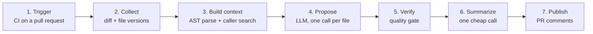

# Groundtruth: design overview

Groundtruth is an AI code reviewer that only posts a finding when it can prove it.
It is written in Python and MIT-licensed.

Most AI pull-request reviewers aim for coverage and comment on everything.
Groundtruth aims for precision, because a wrong comment costs more trust than a
missed bug. Two choices follow from that:

- **Deterministic context.** No vector database or RAG. The engine parses the
  changed function with Tree-sitter, finds its real callers with a text search, and
  fits them into a fixed token budget.
- **Verified findings.** Every finding must quote code that exists in the diff and
  survive a second, skeptical LLM pass before it reaches the pull request.

Users bring their own model and API key (Anthropic, OpenAI, Azure, Bedrock or local
Ollama), chosen by one line of config.

## The seven stages

A review runs as a chain of seven stages. Each one hands a single, well-defined thing
to the next, so any stage can be swapped without touching the others.

| Stage | Hands over | Main tech |
| --- | --- | --- |
| 1. Trigger | The pull request's base and head commits | GitHub Actions (CI) |
| 2. Collect | The diff, plus each changed file before and after | git |
| 3. Build context | Labeled code blocks inside a token budget | Tree-sitter, ripgrep |
| 4. Propose | Candidate findings, each quoting a real line | LiteLLM, any model |
| 5. Verify | Findings that survived every check, ranked | Text matching, SHA-1, a second LLM call |
| 6. Summarize | One grouped summary beside the findings | LiteLLM, cheap tier |
| 7. Publish | Comments on the pull request | GitHub, GitLab or Bitbucket API |

### 1. Trigger

A pull request event starts the run. The CI job checks out the repository with full
history and calls one command, `groundtruth review`.

**Why CI:** the platform's own runner is already the queue and the compute. Nothing
has to be hosted, so installing the tool is one workflow file and one secret.

### 2. Collect the change

Git provides the diff and the full text of each changed file at both the base and the
head commit.

**Why both versions:** the diff alone shows changed lines without the code around
them, and comparing the two versions is what reveals that a function's signature
changed.

### 3. Build context

This stage decides what the model is allowed to see. It makes no AI calls.

- **Tree-sitter** parses each changed file into an AST, so a changed line becomes the
  whole function that contains it.
- **ripgrep** searches the repository for callers of each changed function, with a
  plain Python walk as a fallback when ripgrep is missing.
- If a function's signature changed, its callers are marked must-include and can
  never be dropped.
- Everything is packed into a token budget. Optional blocks shrink to their signature
  line before being dropped, and every cut is reported.

**Why an AST instead of a vector database:** parsing is exact and repeatable.
Similarity search returns code that merely looks related, and a wrong snippet
produces a confident, wrong finding. This way, context is always real code that
provably surrounds the change.

### 4. Propose findings

The model gets one changed file plus the shared context and returns candidate
findings. Each finding must quote the exact line it is about.

- **LiteLLM** is used as a library, so the model is one line of config: Claude,
  OpenAI, Azure, Bedrock or a local Ollama model. The key comes from an environment
  variable.
- One call per changed file, not one call for the whole pull request.

**Why per file:** a single pass over a large diff reports the few most obvious issues
and stops looking. Keeping each call's target small means the fifteenth file gets the
same attention as the first.

**Why the quote:** it is the evidence the next stage checks. A model can claim
anything, but it cannot copy a line that was never written.

### 5. Verify (the quality gate)

Nothing reaches the pull request without clearing five checks, ordered cheapest first
so paid calls are only spent on candidates that could survive.

| Check | How it works | Why |
| --- | --- | --- |
| Quote exists | Whitespace-insensitive text match against the diff and context | Removes invented code before anything else runs |
| Line is in the diff | The reported line must fall inside a changed hunk of that file | A quote can be real while its line number is wrong; that finding used to pass, then fail silently when the platform refused to place a comment off the diff |
| Not a duplicate | SHA-1 fingerprint of file, surrounding code and category, never the model's wording | A reworded finding on untouched code keeps the same ID, so re-runs don't repeat comments |
| Skeptic pass | A second LLM call judges whether the finding is real and worth fixing; its confidence is multiplied with the first model's | Averaging lets a confident wrong answer outvote a doubtful right one. Multiplying makes doubt contagious |
| Rank and cap | Sorted by severity weight × confidence, trimmed to a maximum | Keeps reviews short, so the comments people do see are the ones worth reading |

Every rejected finding records which check dropped it and why, which is what makes
review quality measurable later.

### 6. Summarize

A cheap call turns the verified findings into the text of one summary comment.
Grouping findings that share a cause reads faster than bullets that look
unrelated.

**The guard:** this is the only text on the pull request the gate never checked
itself, so the summarizer may only group and rephrase findings that already
passed — never add a claim. A summary naming a file or line outside the
verified set is discarded, and any error falls back to a plain formatted list.

### 7. Publish

One summary comment is created or updated, plus one comment on the code for each
finding.

**Why a separate adapter:** it depends only on the JSON the command prints, not on
the tool's internals. Supporting GitLab or Bitbucket is then glue code for a
different API, not a redesign.

## Which model does what

Three stages call a model, and they do not need the same one. The model is a
config line, so the tier is a deployment choice rather than a code change.

| Stage | Tier | Why |
| --- | --- | --- |
| 4. Propose | Stronger | Reads a whole file's diff against the context bundle. The ceiling on review quality is set here |
| 5. Verify | Cheap | One bounded question about one finding and its evidence, on a short prompt |
| 6. Summarize | Cheap | Rephrasing text that is already verified, once per pull request |

A finding that was never proposed cannot be recovered downstream, while a
finding that was proposed still has to get past the gate — so the money goes
where the reasoning happens, not where the checking does. Unset tiers resolve
back to the one configured model, so splitting them is opt-in.

## What it deliberately does not use

Several obvious pieces are missing on purpose. Each one was left out for a reason
worth knowing before adding it back.

| Not used | Used instead | Reason |
| --- | --- | --- |
| Vector database, embeddings, RAG | AST parsing plus a caller search | Retrieval guesses at relevance; a wrong snippet turns into a confident, wrong finding |
| A hosted service or shared API key | The user's own key from an environment variable | No shared bill, no contract, and a local Ollama model costs nothing |
| Server, queue and database for normal use | A stateless CI job | One person reviewing their own repository needs a key, not a fleet |
| Spend governance built into the tool | An optional self-hosted LiteLLM proxy, set by one config line | Budgets and caps already exist in that open-source proxy; rebuilding them would add no value |
| Keys in a config file | Environment variables only, with the config file refusing to load anything key-shaped | A file that could hold a secret is a file someone eventually commits |
| Averaged confidence scores | Multiplied scores | A false positive costs more trust than a missed bug, so either model's doubt must be able to block a finding |

One more boundary holds the design together: the context and verification packages
never import platform code. They take a diff and a repository path, and return
findings. That is what makes "any platform, any model" true rather than a slogan.

## Status

All seven stages work today on GitHub, GitLab and Bitbucket Cloud, covered by
186 tests that run offline against fake model clients. A self-hosted server
mode for Bitbucket Data Center is the remaining module.
